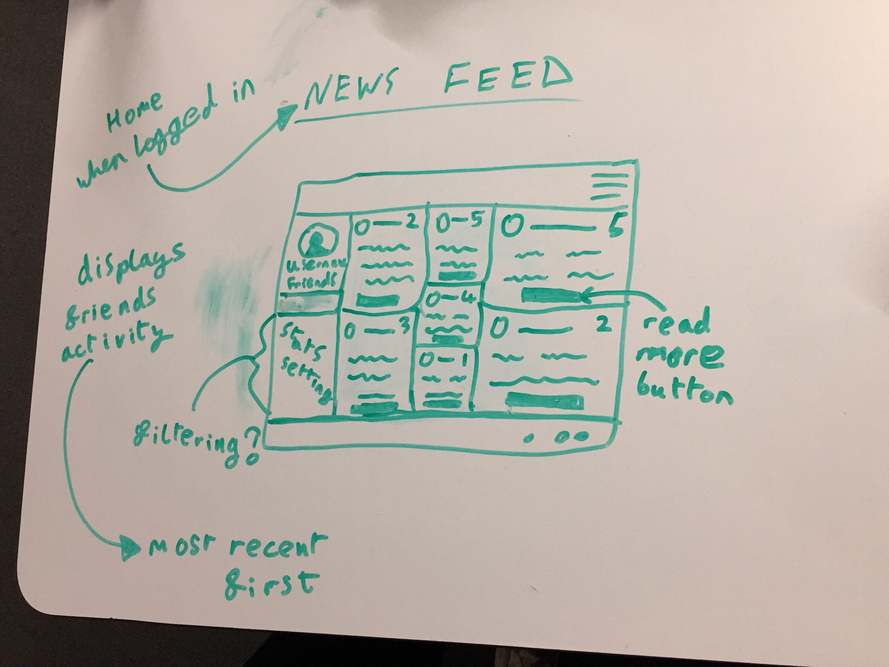

# Filmspotting

## Background

Filmspotting is a social media platform for movies. Users can login and review movies that they have watched.

Launch on [Heroku](https://film-spotting.herokuapp.com/#!/) or check out the GitHub [Repo](https://github.com/zoebarrington/wdi-project-3).

## Course Curriculum
**Week 7-8*** | Module Three
* AngularJS
* Token Authentication & Session Authentication
* Third-party APIs
* Testing - Mocha and Chai

*Full curriculum available at bottom of page*

***

## Brief

Your instructors will partner you with other classmates to design and collaboratively build a MEAN stack app of your own design.

Your app must:
* Use Mongo, Node and Express to build a server-side API
* Have two models, one of which must be a user models
* Include authentication to restrict access to appropriate users
* Include automated tests for at least one resource
* Use Angular to build a front-end which consumes your API  
* Use SCSS instead of CSS  
* Use Webpack and Yarn to manage your dependencies and compile your source code

**Timeframe:** 1 week(November 2018)

## Visuals

### Home Page


### Index Page


### Profile Page


## Technologies Used
* HTML5
* SCSS   
* JavaScript(ECMAScript6)
* Node.js
* angular:v1.7.3
* bulma:v0.7.1
* @uirouter/angularjs:v1.0.20
* moment:v2.22.2
* satellizer:v0.15.5
* MongoDB
* bcrypt:v3.0.2
* body-parser:v1.18.3
* express:v4.16.5
* jsonwebtoken:v8.4.0
* mongoose:v5.3.12
* morgan:v1.9.1
* mocha:v5.2.0
* nyc:v12.0.2
* supertest:v3.1.0
* chai:v4.1.2
* supertest:v3.1.0
* node-sass:v4.7.2
* sass-loader:v6.0.6
* url-loader:v0.6.2
* css-loader:v0.28.9
* babel-core:v6.26.0
* babel-loader:v7.1.2
* babel-preset-env:v1.6.1
* Git
* GitHub
* Heroku
* Trello
* Google Fonts
* Fontawesome

## APIS Used


## Approach Taken

> Teamwork and Time Management
* Daily stand-up every morning
* Summary at end of every day to review what's been achieved that day  
* Co-located work space and online communication (Trello and Slack)
* Continuous status checking throughout each day

### Trello


### Wireframes
#### Home Page  


#### Index Page  


#### Show Page


#### Profile Page  


#### Newsfeed  


## Features
All Features

> All users have access to:
* Home page
* Movie index, show and reviews
* External API of current movies in the cinema
*

> Registered users have access to:
* Log in and log out  
* Add a movie
* Write movie reviews
* Create their own user profile
* Visit other user's profiles and follow them
* View all specified user's reviews on their profile
* View newsfeed consisting of movies reviewed only by followed users

## Featured Piece of Code no.1
```javascript  
$http({
  method: 'GET',
  url: 'https://api.themoviedb.org/3/movie/now_playing?api_key=1712d52487cc8d1fca9c99a892dd1f38&language=en-US&page=1'
}).then(result => {
  $scope.releases = result.data.results;
  console.log('scope', $scope.releases);
});
```

This piece of code is taken from the indexCtrl.js file in the back-end.

## Featured Piece of Code no.2

## Wins and Blockers

## Future Features

* Add maps to show cinemas near you
* Add messaging so that users can message each other about movies/reviews
* Make the app mobile responsive

***

## Course Curriculum

> **Week 1-3** | Module One  
* HTML5
* CSS3 and CSS Animation
* Sass
* JavaScript
* jQuery

> **Week 4** | Project One

> **Week 5** | Module Two  
* Node.js
* Express.js
* EJS
* MongoDB
* User Authentication  

> **Week 6** | Project Two

> **Week 7-8** | Module Three
* AngularJS
* Token Authentication & Session Authentication
* Third-party APIs
* Mocha and Chai

> **Week 9** | Project Three

> **Week 10-11** | Module Four
* React
* JSX
* ES6

>**Week 12** | Project Four

***
## Contact
### Zoe Barrington  
Email: zlfbarrington@gmail.com

[Porfolio](zoebarrington.com) | [LinkedIn](https://www.linkedin.com/notifications/) | [GitHub](https://github.com/zoebarrington)
